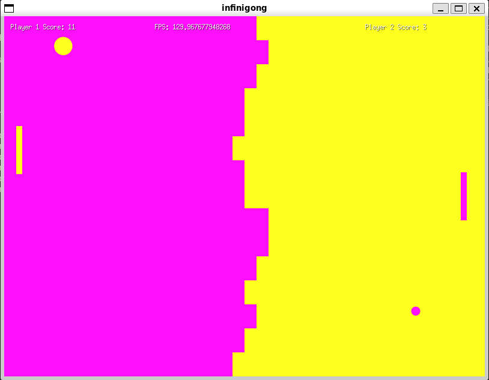

## INFINIGONG

Prototype for an "infinite" pong style game written in Go using [ebitengine](https://ebitengine.org)

Break the bricks and get through to your opponent! (...then what? idk, you win)

### Supported platforms:

 - :heavy_check_mark: Linux x86_64

 - :hear_no_evil: Windows 64bit

 - :heavy_check_mark: WASM

### Features:

 - Score tracking

 - Local Multiplayer (Keys W & S move Player 1, Keys UpArrow & DownArrow Player2)

 - Incremental Ball speed 

 - Incremental Ball Size

 - HUGE FPS

 - One Resolution

 - Sound Effects coming soon

